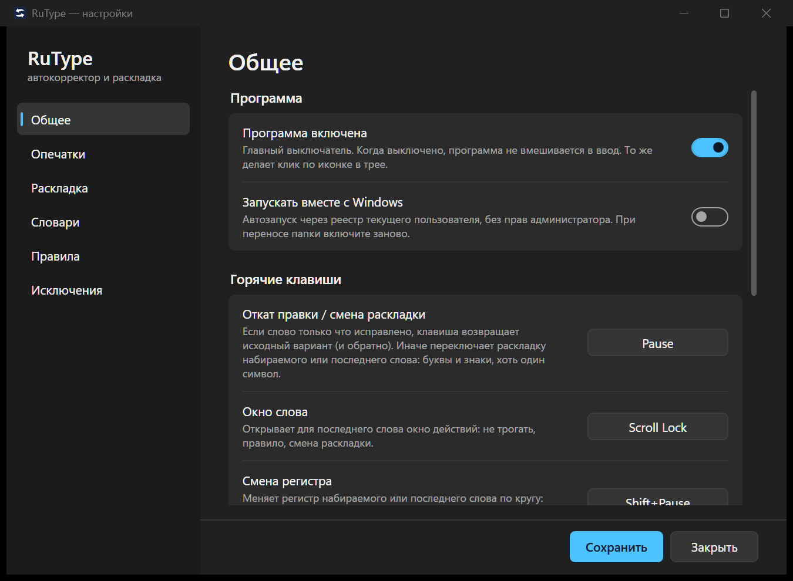

# RuType

Фоновый автокорректор для Windows: исправляет опечатки в русских словах и переключает
раскладку, когда слово набрано не в той (`ghbdtn` → `привет`). Замена Punto Switcher
без облака, рекламы и телеметрии: всё работает локально, данные не покидают компьютер.

## Возможности

- **Опечатки.** Слово, которого нет в словаре, заменяется ближайшим словарным, если
  выбор однозначен. Существует ли слово, решает морфология Hunspell, поэтому редкие
  формы не страдают; на что менять, решают триграммная модель русского языка и частота.
- **Раскладка.** Слово, набранное не в той раскладке, перекладывается и раскладка
  переключается. Консервативно: только если в другой раскладке получается настоящее
  слово. Технические токены (USB, GitHub, win10) защищены, слова с одной чужой буквой
  (`привеn`) чинятся, домены и имена файлов (`пщщпдуюсщь` → `google.com`) тоже.
  Слова с буквами на клавишах знаков (`ж`, `б`, `ю`, `х`, `ъ`, `э`) перекладываются целиком
  вместе с пунктуацией: `ghjljk;bnm?` → `продолжить,`.
- **Одна клавиша на всё.** Pause откатывает последнюю правку (и возвращает обратно),
  а если правки не было — переключает раскладку набираемого или последнего слова, хоть
  с одного символа, вместе со знаками.
- **Окно слова.** Scroll Lock или несколько откатов подряд открывают у курсора окно:
  «не трогать это слово», «всегда менять на …», своё правило замены. Окно не крадёт
  фокус и закрывается кликом мимо.
- **Свои списки.** Мой словарь (слово правильное), стоп-слова (руки прочь), правила
  (`тлф = телефон`, `;jhbr = жорик`).
- **Исключения.** Поля паролей не трогаются и не запоминаются; чёрный список приложений.
  Окна программ, запущенных от администратора, программа не трогает: Windows не пускает
  туда ввод от обычного процесса.
- **Портабельность.** Одна папка, никакой установки, .NET не нужен. Настройки рядом
  с программой. Автозапуск по желанию.

## Установка

1. Скачайте архив из [Releases](https://github.com/garik128/RuType/releases) и распакуйте
   в любую папку (например, `C:\Programs\RuType`).
2. Запустите `RuType.exe`. В трее появится синяя иконка.
3. Первый запуск на пару секунд дольше: строится и кешируется языковая модель.

Обновление: замените содержимое папки новым архивом, папку `data/` с настройками не
трогайте.

Собрать из исходников: нужен .NET 8 SDK, дальше `dotnet build RuType.sln`. Портабл-релиз
собирается одной командой `dotnet publish src/RuType/RuType.csproj -c Release -o dist/RuType`
(подробности и служебные режимы — в [docs/INTERNALS.md](docs/INTERNALS.md)).

## Как пользоваться

- **Иконка в трее**: клик — включить/выключить (серая иконка = выключено), двойной
  клик — настройки, правый клик — меню. Красная вспышка — только что сработала правка.
- **Pause** — откатить правку или переключить раскладку слова. Нажали ещё раз — вернули.
- **Scroll Lock** — окно действий для последнего слова.
- Обе клавиши меняются в настройках, раздел «Общее».
- Звуковые сигналы при правке и смене раскладки отключаются там же.

Что делать, если программа упорно правит нужное слово: нажать Pause (правка откатится),
после нескольких откатов всплывёт окно с предложением занести слово в стоп-слова.
Или сразу Scroll Lock. Или вписать слово в «Настройки → Словари».

## Настройки

Открываются двойным кликом по иконке в трее.

| Раздел | Что там |
|---|---|
| Общее | включение, автозапуск, горячие клавиши, звук, окно слова, лог правок |
| Опечатки | включение, минимальная длина слова, допустимое число отличий, выбор замены |
| Раскладка | автопереключение, пороги длины, технические токены, смешанные слова, домены |
| Словари | мой словарь и стоп-слова |
| Правила | правила замены `что = на что` |
| Исключения | поля паролей, чёрный список приложений |

У каждой настройки есть пояснение прямо в окне. Значения по умолчанию подобраны так,
чтобы программа скорее промолчала, чем испортила текст.

## Приватность

Программа не выходит в сеть. Лог правок `data/corrections.jsonl` по умолчанию выключен
и включается в разделе «Общее». Он содержит только события автозамены и откатов — что на
что заменили — без потока набора, паролей и содержимого окон. Нужен, чтобы настраивать
качество на реальных данных, и остаётся на вашем компьютере.

## Данные

Всё лежит в папке `data/` рядом с `RuType.exe`: `config.json`, `my_words.txt`,
`stopwords.txt`, `rules.txt`, кеш языковой модели и лог правок. Если `config.json` окажется
повреждён, программа сообщит об этом, запустится с настройками по умолчанию и сохранит копию
испорченного файла как `config.json.broken-<дата>`. Автозапуск прописывает
полный путь к exe в реестр текущего пользователя; после переноса папки включите его заново.

## Словари

В папке `dict/`: Hunspell `ru_RU` и `en_US`, частотный список `ru-300k.txt` (топ-300k
из проекта FrequencyWords на данных OpenSubtitles), а также словари-дополнения проекта:
`ru_extra.txt` и `ru_extra.dic` (современная лексика и англицизмы, которых нет в
Hunspell, второй — с флагами склонения) и `en_extra.txt` (технические токены и
аббревиатуры). Как они устроены и как пополнять — в [docs/INTERNALS.md](docs/INTERNALS.md).

## Известные ограничения

- Имена собственные в чужой раскладке (`fvthbrf` → «америка») автоматически не
  перекладываются: словарь знает их только с заглавной, а расширять правило рискованно.
  Pause переложит вручную, «Мой словарь» научит навсегда.
- Новый Блокнот Windows 11 имеет собственный автокорректор и конфликтует с любым
  внешним; отключите автозамену в его настройках.
- Поддерживается только пара раскладок русский/английский.

## Лицензия

Код проекта распространяется по лицензии
[PolyForm Noncommercial 1.0.0](LICENSE): свободно для личного и любого некоммерческого
использования, коммерческое использование запрещено.

Словари имеют собственные лицензии: `ru_RU` и `en_US` — см. `dict/hunspell/*.LICENSE`;
частотный список `ru-300k.txt` — [FrequencyWords](https://github.com/hermitdave/FrequencyWords)
(CC BY-SA 4.0).
